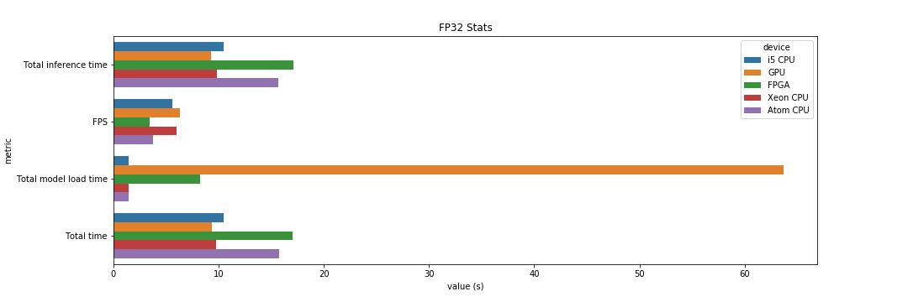
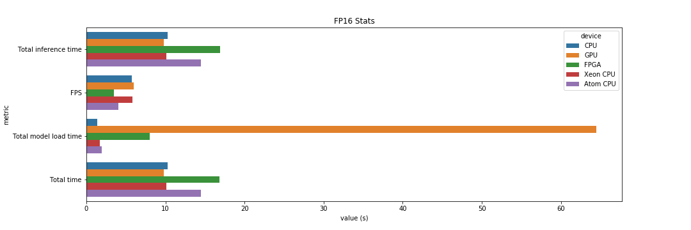
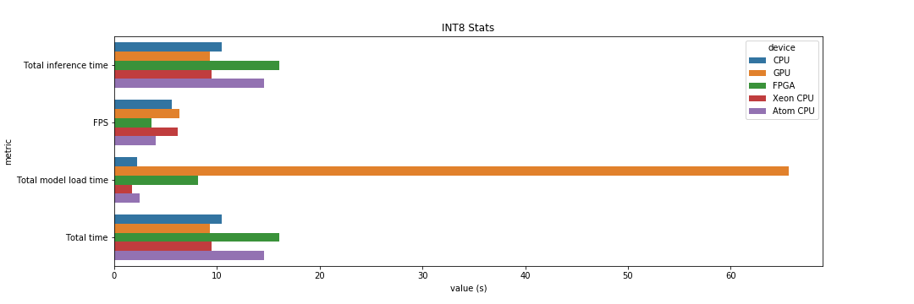

# Computer Pointer Controller

In this project, we are using (live) video streams of a person controlling the movement of the mouse pointer by 
estimating and using the direction of the eyes and head. Sample output is under `resources/out.mp4`.

## Project Set Up and Installation
- Firstly, make sure the OpenVino is installed on your system/cloud server that you are going to run this app on. Follow
[this](https://docs.openvinotoolkit.org/latest/index.html) guide for detailed, step-by-step instructions.

- Secondly, clone the repository with the following command, or copy it from :
`git clone <?>`

- (Optional) Create a virtual python environment and install necessary libraries, with the following commands:
```buildoutcfg
pip install virtualenv
virtualenv --python=/usr/bin/python3.5 <path/to/new/virtualenv/>
source <path/to/new/virtualenv/bin/activate>
cd <path/to/git/cloned/project>
pip install -r requirements.txt
```

- Afterwards, Initialize the openVINO environment:-
```
source /opt/intel/openvino/bin/setupvars.sh -pyver 3.5
```

- Download the following models with the openVINO model downloader:

**1. Face Detection Model**
```
python /opt/intel/openvino/deployment_tools/tools/model_downloader/downloader.py --name "face-detection-adas-binary-0001"
```
**2. Facial Landmarks Detection Model**
```
python /opt/intel/openvino/deployment_tools/tools/model_downloader/downloader.py --name "landmarks-regression-retail-0009"
```
**3. Head Pose Estimation Model**
```
python /opt/intel/openvino/deployment_tools/tools/model_downloader/downloader.py --name "head-pose-estimation-adas-0001"
```
**4. Gaze Estimation Model**
```
python /opt/intel/openvino/deployment_tools/tools/model_downloader/downloader.py --name "gaze-estimation-adas-0002"
```

## Demo

To run a basic demo of this application, execute the following:

```buildoutcfg
python main.py -f </path/to/face/detection/model/xml/file> \
               -fl </path/to/facial/landmarks/detection/model/xml/file> \ 
               -hp </path/to/head/pose/estimation/model/xml/file> \
               -g </path/to/gaze/estimation/model/xml/file> \ 
               -i </path/to/input/video/file/or/string/argument>
               -d <Device name, CPU by default>
```

The `-i` argument can either be a path to a video file or you could give "cam" to use live video stream.
The options for the `-d` argument include CPU, GPU, FPGA, MYRIAD. The latter two are typically used in the Intel 
DevCloud.

## Documentation

Let's go through the command line arguments not mentioned above.

* -fout : Skip a given amount of frames after displaying one on the (live) output video
* -flags : These flags control what will be shown on the (live) output video. Select any from the following and separate
them with spaces to view the output of their corresponding model. If none are specified
    * 'fd' for the Face Detection model
    * 'fld' for the Facial Landmark Detection
    * 'hp' for the Head Pose Estimation and,
    * 'ge' for Gaze Estimation
* -prob : The confidence the model needs to demonstrate to accept face detections.
* -l : Path to CPU targeted custom layers
* -bench : Specify whether this will be run for benchmarking to disable mouse controlling. This is convenient when
running the app on Intel DevCloud. It disables mouse controlling functionality and library import.
* -out : Path to save statistics and output video files.

## Benchmarks
In this section, let's look at the application's performance given different hardware in combination with various 
floating precision models.

**FP32**


**FP16**


**INT8**


## Results

The application was run on 5 different devices on Intel's DevCloud servers. Details of the run can be found under the 
notebook `./src/run_project_3_on_mult_hardware_dev_cloud_final.ipynb`. Use the script under `src/queue_job.sh` in 
combination with this notebook to run the application on Intel's DevCloud. 

Let's map these devices to the legend provided on the plots above:

- i5 CPU : Intel Core i5-6500TE 
- GPU : Intel HD 630
- FPGA : IEI Mustang F100-A10
- Xeon CPU : Intel Xeon E3-1268L v5
- Atom CPU : Intel Atom x7-E3950

For the purposes of this comparison, we have have the total inference time, frames per second, model loading times and 
total time taken to process the whole video stream. We have used a video file provided by Udacity for these tests.

An initial observation is that FPGA devices suffer from longer inference time across all floating point precisions. This
is a trade-off to the device's flexibility to program each gate and ensure compatibility with application loaded on it. 

GPU dominated with the most frames processed per seconds across all other devices and floating point precisions. Due to 
the multitude of processing cores, this is to be expected. Model loading time was unusually high (>60 seconds) for GPUs 
but, since we have experimented with integrated GPUs, this is a one-off operation which we should not need to worry about
during model deployment on the edge. Despite this, it takes the least amount of time to finish processing the video stream,
which re-affirms us of the computing potential of GPUs in such a scenario.

Finally, floating point precision obviously affects model accuracy. This is a trade-off between accuracy and model size and inference
 as they are inversely proportional. 

### Edge Cases

We have accounted for a single person being in the frame only. Having more than one will force the model to get the first
face being detected, which might not be of the same person throughout, breaking the application. In other words, it lacks
recognition capability to stick with the first person that was detected. When a face is not detected, however, we persist
and do not close down the application until a face is detected.
